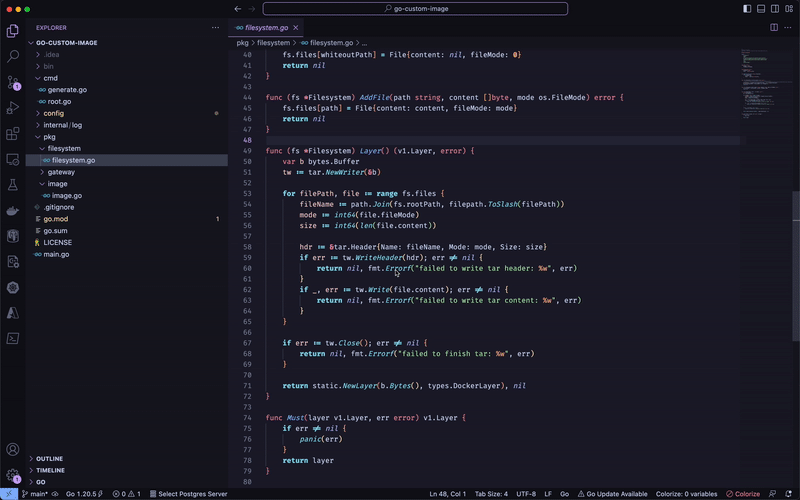

# Juno, your Junior Developer Assistant :sparkles:

Unleash AI power with `Juno` at your side! Leveraging the power of OpenAI, this handy sidekick is here to assist you in your coding journey. By **generating and evaluating code**, `Juno` plays a pivotal role in not only boosting your productivity but also indicating potential areas of improvement. Let's eliminate those pesky bugs together! :beetle:

## :zap: Features 

### :sparkles: Create Code

Using the current editor document or selection run `Create Code` and `Juno` will help generate code or documentation using your own code as context. Get ready to turn those blank lines into art! :pencil2:

### :bulb: Suggest Improvements

Improve your code quality in a jiffy. Use `Suggest Improvements` to get insightful recommendations on how you can enhance your code. Tap into the collective intelligence of countless developers! :brain:

### :mag: Index Repository

`Index Repository` enables you to have a more insightful interaction with your repository. It will vectorize the repository to enable a semantic search, turning your repository into an information goldmine. :open_book:

### :eyes: Query Repository 

Query your repository like never before. `Query Repository` will execute a semantic search against the vectors and generate a response, transforming your code exploration into a fun adventure! :detective:

## How to Use

1. Install the `Juno` extension from VSCode Marketplace.
2. Look for command contributions in your command palette (`Shift+CMD+P` or `F1`).
3. Start exploring!

## Feedback :mailbox:

Loving `Juno`? I want to hear from you! Create a [new issue](https://github.com/emilkje/juno/issues/new) on [GitHub](https://github.com/emilkje/juno) :bug:

Got ideas on how we can make `Juno` better? I'm all ears! Share your thoughts on our [GitHub Discussions](https://github.com/your-github-username/juno/discussions) page :speech_balloon:

I hope `Juno` accelerates your learning, empowers you to code better, and makes programming an absolute joy. Happy coding! :heart: